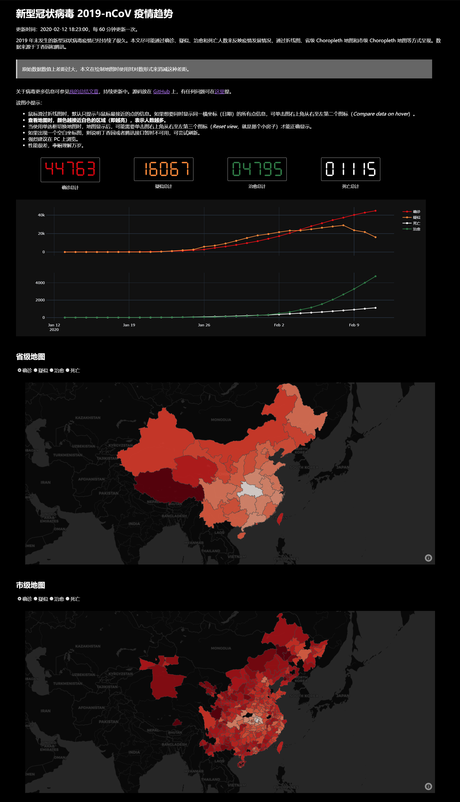
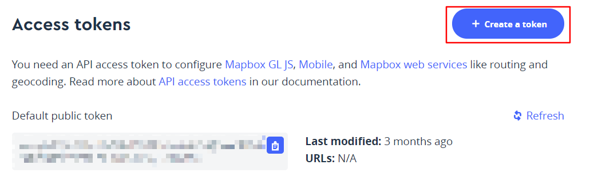

# 2019-nCoV 疫情展示

本项目用于展示新型冠状病毒 2019-nCoV 疫情展示，使用 [dash](https://plot.ly/dash/) 制作。

## 使用

```bash
python app.py
```

然后打开 `http://localhost:9102/` 即可。

如果使用的是 Linux 服务器，则可以使用 gunicorn 来部署：

```bash
gunicorn -c config.py app:server
```

同时修改 [`logging_config.yml`](./logging_config.yml) 中的 `loggers`，将 `__main__` 修改为 `app` 即可。



## 关于 .mapboxtoken

配置文件 [`config.py`](./config.py) 中涉及到了 `.mapboxtoken` 文件，但这并不包含在仓库中。因为并不一定需要，具体什么时候需要这个 token，取决于你使用的 mapbox 地图风格，这一次参数通过 `go.Choroplethmapbox` 的 `mapbox_style` 来指定。简单来说，当你使用如下地图风格之一时，你就需要这个 token 了：

```python
["basic", "streets", "outdoors", "light", "dark", "satellite", "satellite-streets"]
```

如果你需要这个 token，可以去 [mapbox 官网](https://www.mapbox.com/)注册并登录账号，然后点击右上角你的头像，点击 `Account`，然后点击 `Create a token`，根据提示创建即可。



## References

- [Mapbox Map Layers | Python | Plotly](https://plot.ly/python/mapbox-layers/)
- [Mapbox Choropleth Maps | Python | Plotly](https://plot.ly/python/mapbox-county-choropleth/#choropleth-map-using-plotlygraphobjects-and-carto-base-map-no-token-needed)